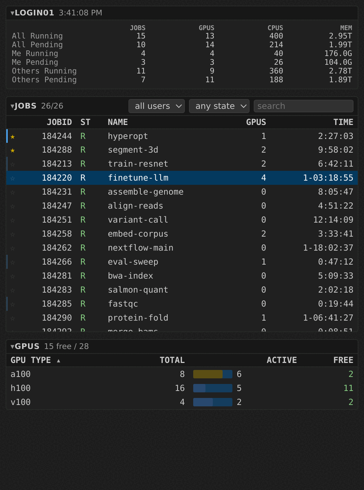
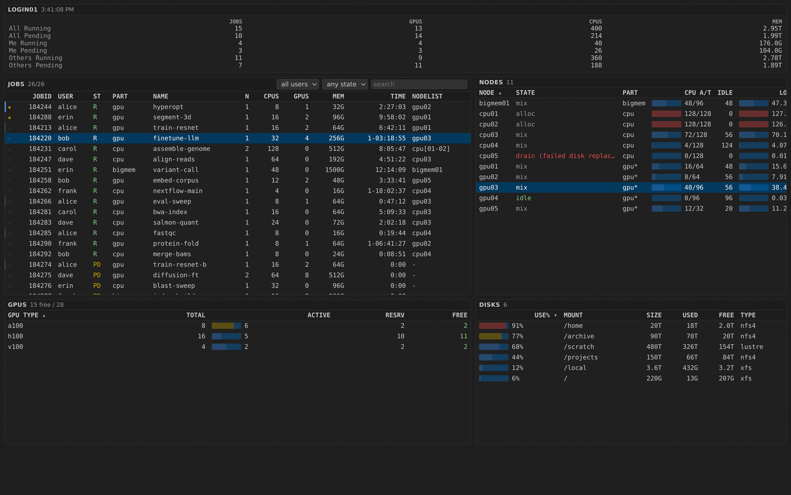
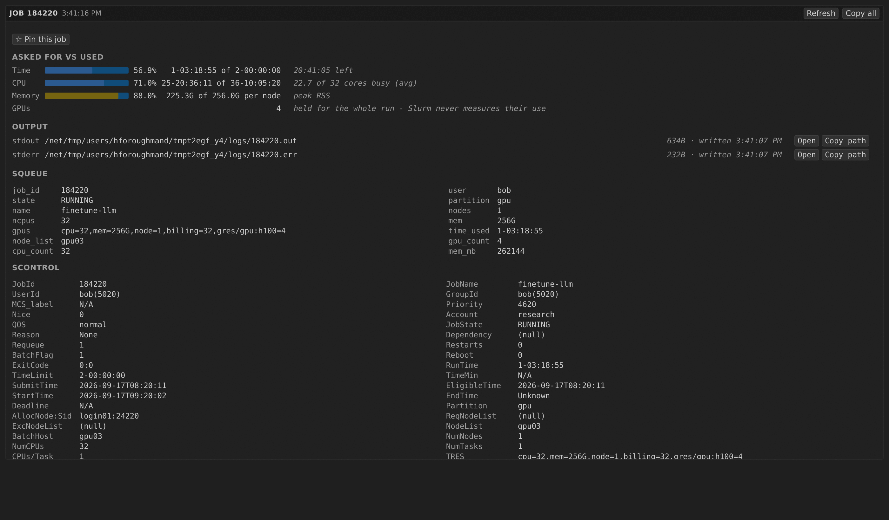
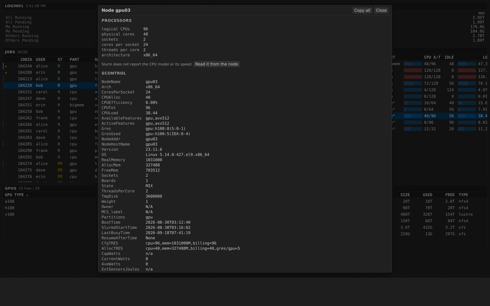

# Slurm Monitor for VS Code

The [slurm-monitor-top](https://github.com/hforoughmand/slurm-monitor-top) dashboard
inside the editor: live jobs, nodes, GPUs and disks, in two sizes.

- **Small** — a compact view in the activity bar. All five panels stacked, each
  foldable by clicking its header, trimmed to the columns that fit ~300px.
- **Large** — a full editor tab (**Slurm: Open Dashboard**) laid out like the
  terminal UI: jobs and nodes side by side, GPUs and disks below.

Both refresh on a timer, keep their scroll position and selection across
refreshes, and share one background collector process.





> The screenshots on this page come from a synthetic cluster used for
> documentation: the users, job names and machines are invented.

## What it shows

| | |
|---|---|
| Jobs | id, user, state, partition, name, nodes, CPUs, GPUs, memory, elapsed time, node list. Filter by owner (all / me / others), by state, or by free text. Click a column to sort, or the star to pin. |
| Machines | state (with the drain reason inline), partition, allocated/total CPUs and idle CPUs, 1-minute load against the core count, total and free memory, allocated/installed GPUs, GPU types, and the CPU model. CPU, load and memory each get a bar. |
| GPUs | per type: total, active, reserved, free. Open one to list the jobs holding it. |
| Disks | `df -h` usage with a bar, mount point, size, used, free, filesystem type. Size columns sort by real bytes, so `2T` sorts above `176G`. |
| Summary | running and pending jobs, GPUs, CPUs and memory, split all / me / others. |

Double-click (or select and press <kbd>Enter</kbd>) a job or machine for its
full `scontrol` details in a popup; press <kbd>c</kbd> to copy the selected row.
<kbd>↑</kbd> and <kbd>↓</kbd> move the selection once a table has focus.

## What a job asked for, and what it is using

A job's details open with an **asked for vs used** block above the raw Slurm
fields: elapsed time against the limit, CPU time against the cores the job
holds, peak memory against the reservation. Each bar is coloured by which end
of its scale is the bad one — a job near its memory ceiling is about to be
killed, and a job using 6% of the cores it reserved is holding the other 94%
idle. Both are red; a comfortable middle is not.

The live half of that comes from `sstat`, which answers only for your own
running jobs, so on someone else's job the block says so rather than showing an
empty bar. GPUs get a line without one: Slurm accounts for the reservation and
never measures the use.

## Reading a job's output

Under those bars, the **output** block gives each stream's path, size and last
write, with **Open**. That opens the real file as an ordinary editor tab —
searchable, and it follows the job as it writes. Two cases it cannot open
directly, and both fall back to fetching the last 1000 lines through the
collector: a file this machine cannot see (a remote `slurmTop.command`), and one
too large to pull through whole.

Slurm records the paths and nothing more, so what is readable is whatever the
account running the collector could `tail` — and `scontrol` shows the paths only
to the job's owner. A script that sent both streams to one file says so instead
of listing the same file twice.

## Pinning the jobs you are watching

Click the star at the left of a job row, or press <kbd>p</kbd> with the row
selected. Pinned jobs lead the table whatever the sort says, so the two runs you
actually care about stay visible under a queue of two hundred.

Pins are kept by the collector, in `~/.config/slurm-monitor-top/config.json`,
not by the editor — so a job pinned here is already on top in the `slurm-top`
terminal dashboard, and the sidebar and the dashboard tab always agree.

## What CPU is in that machine?

Slurm reports how many cores a node has and how they are arranged, but never
*what* they are: there is no model name or clock anywhere in `sinfo` or
`scontrol`. So the **CPU** column shows the layout (`2 x 64C/2T`) until someone
asks for more.

A machine's details open with a **processors** section that answers how many of
what: logical CPUs, physical cores, sockets, cores per socket, threads per core
and architecture — then, once the machine has been read, `2 x EPYC 7763` and
every clock it reports.

Press **Read it from the node** to fill that second half in. The collector
connects over `ssh`, and if the node refuses — many clusters only admit you to a
node where you already have a job — falls back to a one-second Slurm job that
prints `lscpu`. The answer is cached and shared with the terminal UI, so each
machine is read once, ever. Nothing is probed unless you ask.

Each clock says what it is rather than being reported as "the speed": a model
name carrying its own `@ 2.60GHz` gives the `nominal clock`, the speed the
machine runs at, while `max clock` is a boost ceiling one core reaches and
`clock right now` is whatever the governor was doing when we looked. Set
`slurmTop.cpuProbeUsesSrun` to `false` to try `ssh` only.

## Details open in a floating window

`scontrol show job` prints dozens of fields, which is unreadable squeezed into
the sidebar. So details open in a **window of their own** — the same kind of
window you get by moving Settings or an editor out of the main window. It is
resizable, movable, and can live on a second monitor while you work in the main
window. It refreshes on the same interval as the tables, and job ids listed
inside a machine's details are clickable and swap the window to that job.

One window is reused as you click through rows, rather than accumulating twenty
of them.



Machine details list the jobs Slurm placed on that node; their ids are
clickable. Here they are as an `overlay`, over the dashboard that opened them:



This needs VS Code 1.85 or later; on an older build the extension quietly opens
an editor tab instead and says so in **Slurm: Show Extension Log**.

`slurmTop.detailsIn` picks a different shape:

- `window` (default) — the floating window described above.
- `popup` — a floating list over the editor, like the command palette: type to
  filter the fields, <kbd>Enter</kbd> to copy one, <kbd>Escape</kbd> to dismiss.
  Its corner buttons refresh, copy every field, or hand off to a tab. It opens
  no editor tab at all, but has no tables or bars.
- `card` — a card centred in an editor tab, dimming the rest of that tab.
- `tab` — a plain editor tab beside your code, which stays open while you work.
- `overlay` — a panel inside the Slurm view you clicked in.

The webview shapes refresh on the same interval as the tables; `popup` refreshes
on its button instead, because re-filling the list while you are typing a filter
would move the selection out from under you.

**Slurm: Show Job Details…** and **Slurm: Show Node Details…** open details for
an id you type, without going through a table. **Slurm: Open Job Output
(stdout/stderr)…** goes straight to a job's log; when the job wrote two files it
asks which — **both**, stdout or stderr — and **both** opens the pair as two
tabs.

## Requirements

The Slurm client commands (`squeue`, `sinfo`, `scontrol`) must be on `PATH`
wherever the extension runs, plus a Python 3.9+ interpreter.

The extension is marked `workspace`, so under **Remote - SSH** it runs on the
cluster rather than on your laptop, which is normally what you want. Everything
else (a local install, a container) works too as long as the Slurm commands
resolve there.

`slurm-monitor-top` itself does **not** have to be installed: the extension ships
a copy of the pure-stdlib collector and falls back to it. Installing the package
(`pip install slurm-monitor-top`) additionally gives you the `slurm-top` terminal
dashboard, which the **Slurm: Open Terminal Dashboard** command launches; the
command says so rather than failing if the package is missing.

## Settings

| Setting | Default | |
|---|---|---|
| `slurmTop.refreshInterval` | `3` | Seconds between refreshes. |
| `slurmTop.pythonPath` | `""` | Interpreter for the collector. Empty tries `python3`, then `python`. |
| `slurmTop.command` | `[]` | Full argv that emits slurm-top JSON, for unusual setups — for example `["ssh", "login01", "slurm-top", "--json"]`. Data-mode flags are appended. |
| `slurmTop.pauseWhenHidden` | `true` | Stop polling while no Slurm view is on screen. |
| `slurmTop.sidebarSections` | all five | Which sections the narrow view shows, in order. Panels there fold by clicking the header. The dashboard always shows all five. |
| `slurmTop.detailsIn` | `"window"` | `window` for a floating window of its own, `popup` for a command-palette-style list, `card` for a centred card in a tab, `tab` for a plain editor tab, `overlay` for a panel inside the view. |
| `slurmTop.defaultOwnerFilter` | `"me"` | Whose jobs to show on open. |
| `slurmTop.cpuProbeUsesSrun` | `true` | When reading a machine's CPU model, fall back to a one-second Slurm job if `ssh` to that node is refused. Probes only ever run when you ask for one. |

## How it gets its data

The extension does not parse Slurm output itself. It runs

```
slurm-top --json --watch <interval>
```

which prints one JSON snapshot per line, produced by the same
`slurm_top.data` parsers the terminal UI uses — so the TRES, GRES and memory-unit
handling can only be right or wrong in one place. Details come from
`slurm-top --json --job <id>` / `--node <name>`, one call each. One long-lived process rather
than one spawn per tick keeps a shared login node quiet.

Pinning and CPU probes go through the same command — `--toggle-pin <id>` and
`--node <name> --probe-cpu` — rather than through editor storage, which is what
keeps both front ends on one list of pins and one CPU cache.

Collector resolution, in order: `slurmTop.command`; `<python> -m
slurm_top.export`; `slurm-top --json` on `PATH`; the copy bundled in the
extension. **Slurm: Show Extension Log** reports which one was chosen.

## Developing

```bash
cd vscode-extension
npm install
npm run compile   # also refreshes the bundled Python copy
npm test          # headless checks, no VS Code needed
```

`npm test` runs four suites. `test/webview.smoke.js` drives `media/main.js` in
jsdom against a fixture snapshot and checks that tables fill, filters and sorts
apply, rows update in place rather than duplicating, and the detail overlays
render. `test/quickpick.smoke.js` stubs VS Code's quick pick and checks the
detail popup's field list, grouping, copy-on-Enter, the node-to-job jump and its
error handling. `test/detail.smoke.js` checks that the floating window is
created as the active editor and actually moved out, that an older VS Code
without that command falls back to a tab, and that every `detailsIn` value —
including the names it used earlier in development — resolves to the right
shape. `test/host.smoke.js` stubs the `vscode` module and exercises the real
collector resolution, NDJSON streaming and restart-after-crash paths against the
live cluster, so it needs `squeue` and `sinfo` on `PATH`.

Then press <kbd>F5</kbd> in VS Code to launch an Extension Development Host.

## Installing and publishing

`npm run package` produces a `.vsix`. Install it locally with
**Extensions: Install from VSIX…**, or from a terminal:

```bash
code --install-extension slurm-monitor-top-0.5.0.vsix --force
```

Under Remote - SSH, run that on the cluster so it lands in the remote server's
extension directory. Either way, reload the window afterwards
(**Developer: Reload Window**) — VS Code loads extension code once at window
start. `--force` matters whenever the version has not changed, because the CLI
skips an install for a version that is already present.

To publish so that anyone can install it from the Extensions view:

```bash
npx @vscode/vsce login <publisher>   # needs an Azure DevOps personal access token
npm run publish-vsce                 # or: npm run publish-vsce -- minor
```

Use the script rather than `vsce publish` directly: both it and `npm run
package` pass `--baseContentUrl`, without which vsce resolves this README's
relative image links against the repository root instead of this folder and the
Marketplace listing ends up with broken images.

This needs a Marketplace publisher whose id matches `publisher` in
[package.json](package.json), currently `hforoughmand`. Create one at
<https://marketplace.visualstudio.com/manage> and generate a token with
**Marketplace → Manage** scope for all organisations.

For VSCodium and other builds that do not use the Microsoft marketplace, publish
the same `.vsix` to Open VSX as well:

```bash
npx ovsx publish slurm-monitor-top-0.5.0.vsix -p <open-vsx-token>
```

Bump `version` in [package.json](package.json) and add a
[CHANGELOG.md](CHANGELOG.md) entry for every release; the Marketplace refuses a
version it has already seen.

The bundled Python under `vscode-extension/python/` is generated by
`scripts/sync-python.js` from `src/slurm_top/`; edit the sources at the
repository root, never the copy.
